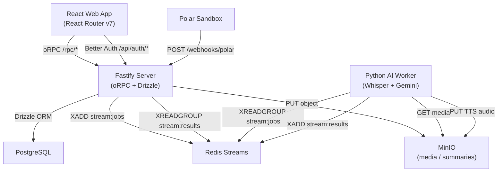
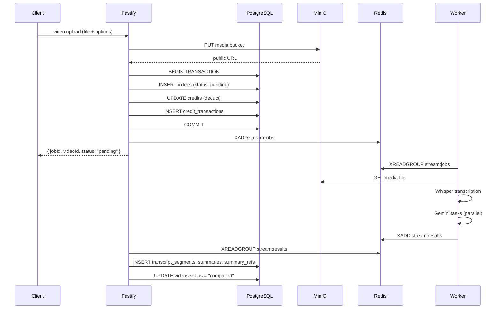

# Design Document — MediaMind Full Platform

## Overview

MediaMind is a monorepo platform for uploading video/audio files, transcribing them with Whisper, and running configurable AI analysis (summarize, keywords, main ideas, notes, audio summary) via Gemini. Results are presented in a synced transcript viewer with citation highlights.

The system is built on:
- **Frontend**: React Router v7 + Tailwind + shadcn/ui, communicating via oRPC + TanStack Query
- **Backend**: Fastify + oRPC + Drizzle ORM on PostgreSQL
- **Queue**: Redis Streams (stream:jobs → worker, stream:results → server)
- **Storage**: MinIO (media uploads + TTS audio)
- **AI Worker**: Python, Whisper + Gemini, async consumer
- **Auth**: Better Auth (email/password + Google OAuth)
- **Payments**: Polar sandbox (webhook-only credit grant)

All shared TypeScript types live in `@repo/types`. Credit costs and stream key constants live in `@repo/config`. The database schema lives in `packages/db`.

---

## Architecture



### Upload & Processing Flow



---

## Components and Interfaces

### Package Structure

```
packages/
  types/src/index.ts          — all shared TS types (VideoStatus, Video, Summary, etc.)
  config/src/
    credits.ts                — CREDIT_COSTS constant
    streams.ts                — STREAM_KEYS, CONSUMER_GROUPS constants
  db/src/
    index.ts                  — Drizzle client export
    schema/
      auth.ts                 — Better Auth managed tables
      media.ts                — videos, transcript_segments, summaries, summary_refs, credits, credit_transactions

apps/
  server/src/
    index.ts                  — Fastify bootstrap, plugin registration, Better Auth route, Polar webhook
    lib/
      minio.ts                — MinIO client + bucket init
      redis.ts                — ioredis client
      result-consumer.ts      — background XREADGROUP consumer for stream:results
    routes/
      polar-webhook.ts        — POST /webhooks/polar handler
  worker/src/
    main.py                   — XREADGROUP consumer loop + startup
    models.py                 — Pydantic models
    transcriber.py            — Whisper wrapper
    summarizer.py             — Gemini summary + refs
    extractor.py              — Gemini keywords, main ideas, notes
    tts.py                    — Google TTS / Gemini audio
    storage.py                — MinIO upload helper
    redis_client.py           — Stream publish/consume helpers

packages/api/src/
  context.ts                  — createContext (session, db, redis)
  index.ts                    — o, publicProcedure, protectedProcedure
  routers/
    index.ts                  — appRouter (video, queue, credits, billing)
    video.ts                  — upload, getStatus, getDetail
    queue.ts                  — list
    credits.ts                — getBalance, getHistory
    billing.ts                — getProducts, createCheckout

apps/web/src/
  routes/
    login.tsx                 — /login
    register.tsx              — /register
    upload.tsx                — /upload (protected)
    queue.tsx                 — /queue (protected)
    video.$id.tsx             — /video/:id (protected)
    billing.tsx               — /billing (protected)
    billing.checkout.tsx      — /billing/checkout
  components/
    upload/
      DropZone.tsx
      FilePreview.tsx
      OptionsPanel.tsx
      CreditSummary.tsx
    queue/
      JobCard.tsx
      StatusBadge.tsx
      ProgressBar.tsx
    video/
      MediaPlayer.tsx
      TranscriptPanel.tsx
      SummaryPanel.tsx
      NotesPanel.tsx
      AudioSummaryPlayer.tsx
    billing/
      BalanceCard.tsx
      ProductCard.tsx
      TransactionRow.tsx
```

### oRPC API Contracts

```ts
// video router
video.upload(input: {
  title: string
  mediaType: "video" | "audio"
  mimeType: string
  fileSize: number
  mediaUrl: string
  options: ProcessingOptions
}) → { jobId: string; videoId: string; status: "pending" }

video.getStatus(input: { videoId: string })
  → { status: VideoStatus; progress: number | null; currentStep: string | null }

video.getDetail(input: { videoId: string }) → VideoDetail

// queue router
queue.list({}) → { jobs: QueueJob[] }

// credits router
credits.getBalance({}) → { balance: number; totalSpent: number }
credits.getHistory(input: { limit: number; cursor?: string })
  → { transactions: CreditTransaction[]; nextCursor: string | null }

// billing router
billing.getProducts({}) → { products: PolarProduct[] }
billing.createCheckout(input: { productId: string }) → { checkoutUrl: string }
```

### MinIO Upload Flow

The server receives the raw multipart file, validates size and MIME type, then streams it to MinIO before creating the DB record. The public URL returned by MinIO is stored in `videos.mediaUrl`. The client never receives raw bytes — only the URL.

### Redis Stream Message Shapes

`stream:jobs` fields (all string-encoded):
- `jobId`, `videoId`, `userId`, `mediaUrl`, `mediaType`, `options` (JSON string)

`stream:results` fields:
- `jobId`, `videoId`, `status`, `error`, `transcript` (JSON), `summary`, `summaryRefs` (JSON), `keywords` (JSON), `mainIdeas` (JSON), `notes`, `audioSummaryUrl`

### Polar Webhook

`POST /webhooks/polar` is a raw Fastify route (not oRPC). It validates the `Polar-Signature` header using `POLAR_WEBHOOK_SECRET`, then on `order.created` events:
1. Extracts `metadata.userId` and the product's credit amount
2. Increments `credits.balance` in a DB transaction
3. Inserts a `credit_transactions` row with `reason: "polar_purchase"`

### Better Auth Integration

Better Auth manages the `user`, `session`, `account`, and `verification` tables. The Fastify server exposes `GET|POST /api/auth/*` which proxies to `auth.handler()`. The oRPC context extracts the session via `auth.api.getSession()` on every request. On new user creation, a `credits` row is inserted with `balance: 50` via a Better Auth `onUserCreate` hook.

### Result Consumer (Background)

`apps/server/src/lib/result-consumer.ts` starts an async loop on server boot:
1. `XREADGROUP GROUP server consumer-1 COUNT 10 BLOCK 5000 STREAMS stream:results >`
2. For each message, parse the `ResultPayload`
3. If `status: "completed"`: insert transcript segments, upsert summary + refs, set `videos.status = "completed"`
4. If `status: "failed"`: set `videos.status = "failed"`
5. `XACK stream:results server <id>`

---

## Data Models

### Database Schema (Drizzle, PostgreSQL)

The schema already exists in `packages/db/src/schema/media.ts`. Key design decisions:

- `videos.options` is `jsonb` — stores `ProcessingOptions` as a JSON object
- `transcript_segments.index` is an integer for deterministic ordering (not relying on insertion order)
- `summaries.videoId` has a unique constraint — one summary per video
- `summary_refs.transcriptIndices` is `integer[]` — PostgreSQL array
- `credits.userId` is the primary key — one row per user
- `credit_transactions.metadata` is `jsonb` — stores `{ videoTitle, videoId }` for job deductions

### Inferred Types

```ts
// packages/db/src/schema/media.ts exports:
export type DbVideo = typeof videos.$inferSelect
export type NewDbVideo = typeof videos.$inferInsert
export type DbTranscriptSegment = typeof transcriptSegments.$inferSelect
export type DbSummary = typeof summaries.$inferSelect
export type DbSummaryRef = typeof summaryRefs.$inferSelect
export type DbCredit = typeof credits.$inferSelect
export type DbCreditTransaction = typeof creditTransactions.$inferSelect
```

Shared API-facing types come from `@repo/types` and are mapped from DB types in router handlers.

### Python Worker Pydantic Models

```python
class ProcessingOptions(BaseModel):
    transcribe: bool = True
    summarize: bool = False
    extract_keywords: bool = False
    extract_main_ideas: bool = False
    generate_notes: bool = False
    generate_audio_summary: bool = False

class JobMessage(BaseModel):
    job_id: str
    video_id: str
    user_id: str
    media_url: str
    media_type: Literal["video", "audio"]
    options: ProcessingOptions

class TranscriptSegment(BaseModel):
    start: float
    end: float
    text: str

class SummaryRef(BaseModel):
    sentence_index: int
    transcript_indices: list[int]

class GeminiSummaryResponse(BaseModel):
    summary: str
    refs: list[SummaryRef]

class GeminiNotesResponse(BaseModel):
    notes: str

class ResultMessage(BaseModel):
    job_id: str
    video_id: str
    status: Literal["completed", "failed"]
    error: str | None = None
    transcript: list[TranscriptSegment] = []
    summary: str | None = None
    summary_refs: list[SummaryRef] = []
    keywords: list[str] = []
    main_ideas: list[str] = []
    notes: str | None = None
    audio_summary_url: str | None = None
```

### Frontend State

The upload form maintains local state:
- `file: File | null` — selected file
- `options: ProcessingOptions` — toggled AI options (transcribe always true)
- `balance: number` — fetched from `credits.getBalance`
- `totalCost: number` — derived by summing `CREDIT_COSTS` for enabled options

The queue screen uses TanStack Query with a polling interval:
- `useQuery(orpc.queue.list.queryOptions())` — initial load
- `useQuery(orpc.video.getStatus.queryOptions({ videoId }), { refetchInterval: hasActiveJobs ? 3000 : false })`

The media detail view tracks `currentTime` via a ref synced to the media element's `timeupdate` event, used to derive the active segment index.


---

## Correctness Properties

*A property is a characteristic or behavior that should hold true across all valid executions of a system — essentially, a formal statement about what the system should do. Properties serve as the bridge between human-readable specifications and machine-verifiable correctness guarantees.*

### Property 1: Credit cost computation is additive over options

*For any* `ProcessingOptions` object, the computed credit cost must equal the sum of `CREDIT_COSTS[key]` for every key where the option is `true`. Disabling an option must reduce the total by exactly that option's cost.

**Validates: Requirements 2.3**

---

### Property 2: Successful upload creates a video record and enqueues a job

*For any* authenticated user with sufficient balance and a valid file (allowed MIME type, size ≤ 500MB), calling `video.upload` must result in: (a) a `videos` row with `status: "pending"` in the DB, (b) a message on `stream:jobs` containing the correct `videoId` and `jobId`, and (c) the response containing `{ jobId, videoId, status: "pending" }`.

**Validates: Requirements 7.1, 7.5, 7.6**

---

### Property 3: Credit deduction is exact and atomic

*For any* authenticated user with balance B and a valid upload with computed cost C (where C ≤ B), after a successful `video.upload` call the user's `credits.balance` must equal B − C, and a `credit_transactions` row with `delta: -C` must exist.

**Validates: Requirements 7.3**

---

### Property 4: Insufficient credits prevents upload

*For any* `ProcessingOptions` where `computeCreditCost(options) > userBalance`, calling `video.upload` must return an `INSUFFICIENT_CREDITS` error, and no `videos` row or `stream:jobs` message must be created.

**Validates: Requirements 7.4**

---

### Property 5: File validation rejects invalid inputs

*For any* file where `size > 500MB` OR `mimeType` is not in the allowed set (mp4, mov, mkv, webm, mp3, wav, m4a), calling `video.upload` must return `FILE_TOO_LARGE` or `UNSUPPORTED_FORMAT` respectively, and no DB record must be created.

**Validates: Requirements 7.7, 7.8**

---

### Property 6: Queue list returns only the requesting user's jobs

*For any* authenticated user U, `queue.list` must return a list where every job's `video.userId` equals U's ID, ordered by `createdAt` descending, with length equal to the number of videos belonging to U.

**Validates: Requirements 8.1**

---

### Property 7: Cross-user access is rejected

*For any* `videoId` that belongs to user A, calling `video.getStatus` or `video.getDetail` as user B (where B ≠ A) must return an `UNAUTHORIZED` error.

**Validates: Requirements 8.3, 9.3**

---

### Property 8: getDetail returns transcript segments sorted by index

*For any* completed video with N transcript segments, `video.getDetail` must return all N segments with `segment[i].index < segment[i+1].index` for all i, and the summary with all its refs.

**Validates: Requirements 9.1**

---

### Property 9: getDetail rejects non-completed videos

*For any* video with `status` in `{ "pending", "processing", "failed" }`, calling `video.getDetail` must return a `NOT_READY` error.

**Validates: Requirements 9.2**

---

### Property 10: totalSpent equals absolute sum of negative transactions

*For any* user with a set of `credit_transactions`, `credits.getBalance` must return `totalSpent` equal to the sum of `Math.abs(delta)` for all transactions where `delta < 0`.

**Validates: Requirements 10.1**

---

### Property 11: Paginated history respects limit and cursor

*For any* user with M transactions and a request with `limit: N`, `credits.getHistory` must return at most N transactions, and `nextCursor` must be non-null if and only if M > N. Fetching the next page using the cursor must return the next N transactions without overlap or gaps.

**Validates: Requirements 10.2**

---

### Property 12: Polar webhook signature validation

*For any* request to `POST /webhooks/polar` with an invalid or missing `Polar-Signature` header, the server must return HTTP 401 and must not modify any DB state. For any request with a valid signature and `order.created` event, the user's `credits.balance` must increase by the purchased amount and a `credit_transactions` row with `reason: "polar_purchase"` must be inserted.

**Validates: Requirements 11.1, 11.2, 11.3**

---

### Property 13: Result consumer correctly persists completed jobs

*For any* `ResultPayload` with `status: "completed"` consumed from `stream:results`, the DB must contain all transcript segments from the payload (with correct start/end/text), a `summaries` row, all `summary_refs`, and `videos.status` must be `"completed"`. The message must be acknowledged with XACK.

**Validates: Requirements 12.2, 12.4**

---

### Property 14: Transcript segments have valid time ranges

*For any* audio/video input processed by the AI worker, every `TranscriptSegment` in the output must satisfy `segment.start >= 0`, `segment.end > segment.start`, and segments must be non-overlapping (i.e., `segment[i].end <= segment[i+1].start` for all i).

**Validates: Requirements 13.4**

---

### Property 15: Gemini response Pydantic validation round-trip

*For any* valid JSON string conforming to the Gemini response schemas, parsing with the corresponding Pydantic model must succeed and produce an object whose serialization equals the original JSON. For keywords, the parsed list must have at most 10 items. For main ideas, the parsed list must have 3–5 items.

**Validates: Requirements 14.1, 14.2, 14.3, 14.4**

---

### Property 16: Upload form credit total matches options

*For any* combination of toggled `ProcessingOptions` in the upload form UI, the displayed total credit cost must equal `sum(CREDIT_COSTS[key] for enabled keys)`, and the submit button must be disabled if and only if `totalCost > userBalance` or no file is selected.

**Validates: Requirements 16.6, 16.7**

---

### Property 17: Upload form rejects invalid files client-side

*For any* file where `size > 500MB` or the file extension/MIME type is not in the allowed set, the upload form must display an inline error message and the submit button must remain disabled.

**Validates: Requirements 16.3, 16.4**

---

### Property 18: Active transcript segment derivation

*For any* `currentTime` value and any list of `TranscriptSegment` records, the active segment must be the unique segment (if any) where `segment.start <= currentTime < segment.end`. If no segment matches, no segment must be highlighted.

**Validates: Requirements 18.2**

---

### Property 19: Summary citation hover highlights correct segments

*For any* summary sentence with associated `SummaryRef` entries, hovering over that sentence must produce a highlighted set of segment IDs equal to the union of all `transcriptIndices` across that sentence's refs.

**Validates: Requirements 18.6**

---

### Property 20: Transaction reason label mapping

*For any* `CreditTransaction`, the rendered label must be `"Credit top-up"` when `reason === "polar_purchase"`, and `"Processing: {metadata.videoTitle}"` when `reason === "job_deduction"`. All other reason values must render the raw reason string.

**Validates: Requirements 19.5, 19.6**

---

## Error Handling

### Server-Side Errors (oRPC)

All errors are thrown as `ORPCError` with typed codes:

| Scenario | Error Code | HTTP Status |
|---|---|---|
| Unauthenticated request | `UNAUTHORIZED` | 401 |
| Video belongs to different user | `UNAUTHORIZED` | 401 |
| Insufficient credits | `FORBIDDEN` (message: `INSUFFICIENT_CREDITS`) | 403 |
| File too large | `BAD_REQUEST` (message: `FILE_TOO_LARGE`) | 400 |
| Unsupported MIME type | `BAD_REQUEST` (message: `UNSUPPORTED_FORMAT`) | 400 |
| Video not completed | `BAD_REQUEST` (message: `NOT_READY`) | 400 |
| Polar signature invalid | HTTP 401 (raw Fastify route) | 401 |

### Client-Side Errors

- File validation errors are shown inline below the drop zone before any network call
- Insufficient credits shows a warning with a link to `/billing`
- Network errors on upload show a retry button (TanStack Query mutation `onError`)
- The global `QueryCache.onError` in `orpc.ts` shows a toast for unexpected query failures

### Worker Error Handling

- Each job is retried up to 3 times before publishing `status: "failed"`
- Gemini JSON parse failures trigger a retry of the Gemini call (up to 3 times)
- SIGTERM causes the worker to finish the current job before exiting
- All errors are logged with `logging` module including `job_id` and step name
- Stale messages (pending > threshold) are reclaimed via `XCLAIM`

---

## Testing Strategy

### Dual Testing Approach

Both unit tests and property-based tests are required. They are complementary:
- Unit tests cover specific examples, integration points, and edge cases
- Property tests verify universal correctness across randomized inputs

### Property-Based Testing

**Library choices:**
- TypeScript (server/frontend): [fast-check](https://github.com/dubzzz/fast-check)
- Python (worker): [hypothesis](https://hypothesis.readthedocs.io/)

Each property test must run a minimum of **100 iterations**.

Each test must be tagged with a comment in this format:
```
// Feature: mediamind-full-platform, Property N: <property_text>
```

Each correctness property above maps to exactly one property-based test:

| Property | Test Location | Library |
|---|---|---|
| 1 — Credit cost computation | `packages/config/src/__tests__/credits.test.ts` | fast-check |
| 2 — Upload creates record + job | `packages/api/src/__tests__/video.upload.test.ts` | fast-check |
| 3 — Credit deduction is exact | `packages/api/src/__tests__/video.upload.test.ts` | fast-check |
| 4 — Insufficient credits prevents upload | `packages/api/src/__tests__/video.upload.test.ts` | fast-check |
| 5 — File validation rejects invalid inputs | `packages/api/src/__tests__/video.upload.test.ts` | fast-check |
| 6 — Queue list returns only user's jobs | `packages/api/src/__tests__/queue.test.ts` | fast-check |
| 7 — Cross-user access rejected | `packages/api/src/__tests__/video.auth.test.ts` | fast-check |
| 8 — getDetail segments sorted by index | `packages/api/src/__tests__/video.detail.test.ts` | fast-check |
| 9 — getDetail rejects non-completed | `packages/api/src/__tests__/video.detail.test.ts` | fast-check |
| 10 — totalSpent computation | `packages/api/src/__tests__/credits.test.ts` | fast-check |
| 11 — Paginated history | `packages/api/src/__tests__/credits.test.ts` | fast-check |
| 12 — Polar webhook validation | `apps/server/src/__tests__/polar-webhook.test.ts` | fast-check |
| 13 — Result consumer persists completed jobs | `apps/server/src/__tests__/result-consumer.test.ts` | fast-check |
| 14 — Transcript segment time ranges | `apps/worker/tests/test_transcriber.py` | hypothesis |
| 15 — Gemini Pydantic round-trip | `apps/worker/tests/test_models.py` | hypothesis |
| 16 — Upload form credit total | `apps/web/src/__tests__/OptionsPanel.test.ts` | fast-check |
| 17 — Upload form file validation | `apps/web/src/__tests__/DropZone.test.ts` | fast-check |
| 18 — Active segment derivation | `apps/web/src/__tests__/TranscriptPanel.test.ts` | fast-check |
| 19 — Citation hover highlights | `apps/web/src/__tests__/SummaryPanel.test.ts` | fast-check |
| 20 — Transaction reason label mapping | `apps/web/src/__tests__/TransactionRow.test.ts` | fast-check |

### Unit Tests

Unit tests focus on:
- Auth flow: login redirects, register creates credits row, protected route redirect (Requirements 15.x)
- Upload form: drag-and-drop interaction, file preview display (Requirements 16.1, 16.2)
- Queue screen: empty state rendering, status badge variants (Requirements 17.1, 17.7)
- Media detail: video vs audio player rendering, notes Markdown rendering, audio summary player (Requirements 18.1, 18.8, 18.9)
- Billing dashboard: product card rendering, balance card display (Requirements 19.1, 19.2, 19.3)
- MinIO bucket init: idempotent bucket creation on server startup (Requirements 6.1, 6.2)
- Shared types: all exports present from `@repo/types` (Requirements 1.1, 1.2)
- Config constants: CREDIT_COSTS and STREAM_KEYS values (Requirements 2.1, 2.2)
- Welcome credits: new user signup inserts credits row with balance 50 (Requirement 3.7)
