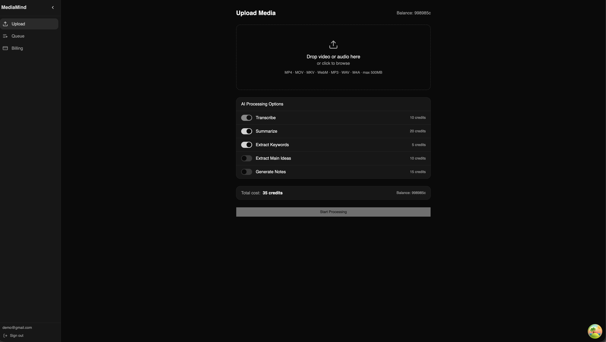
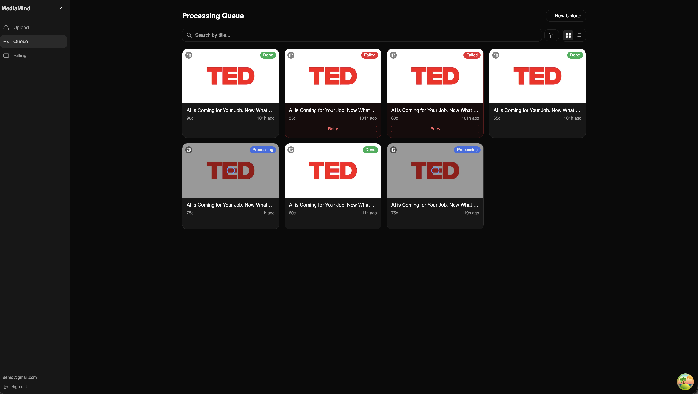
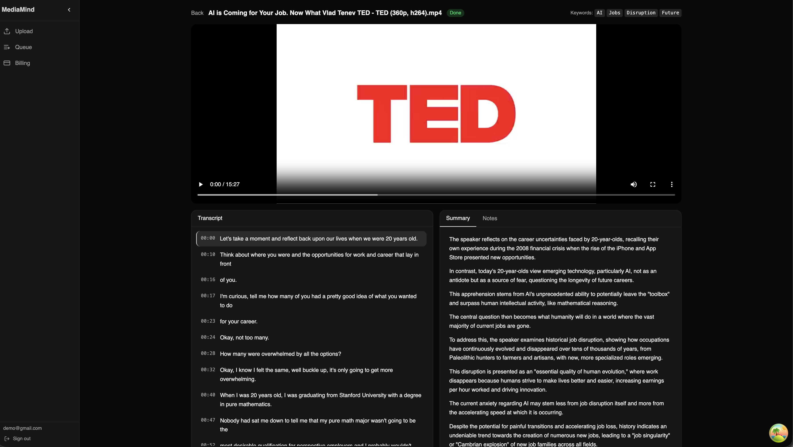
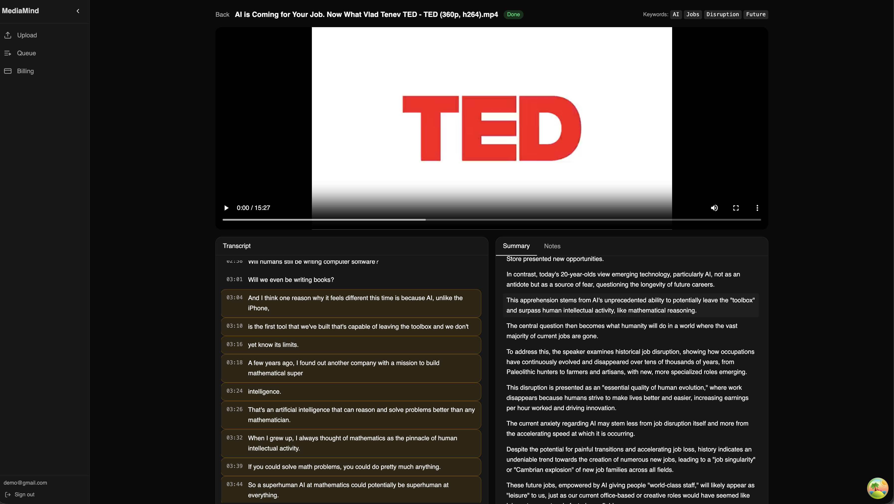
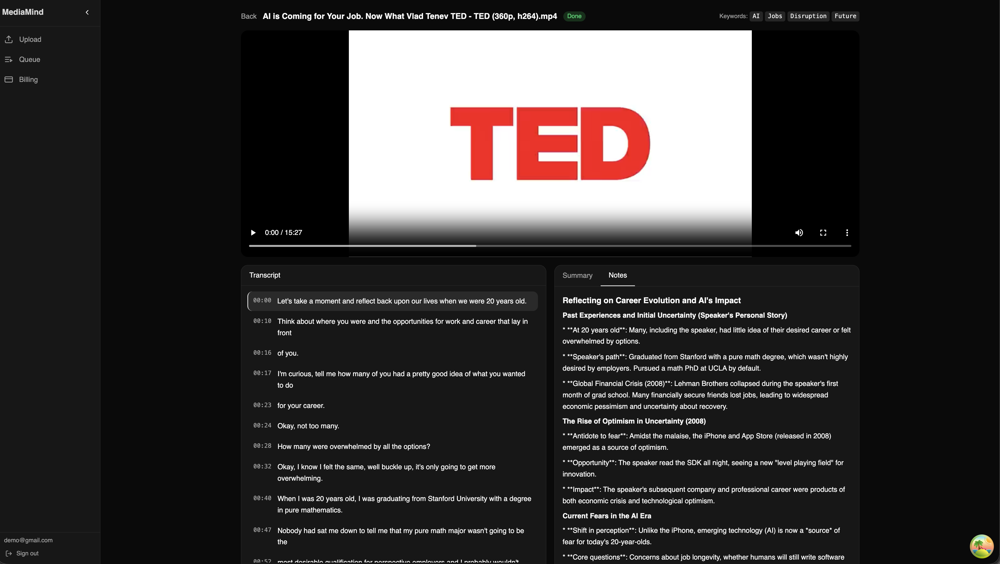
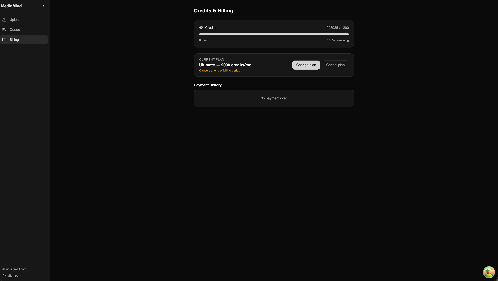
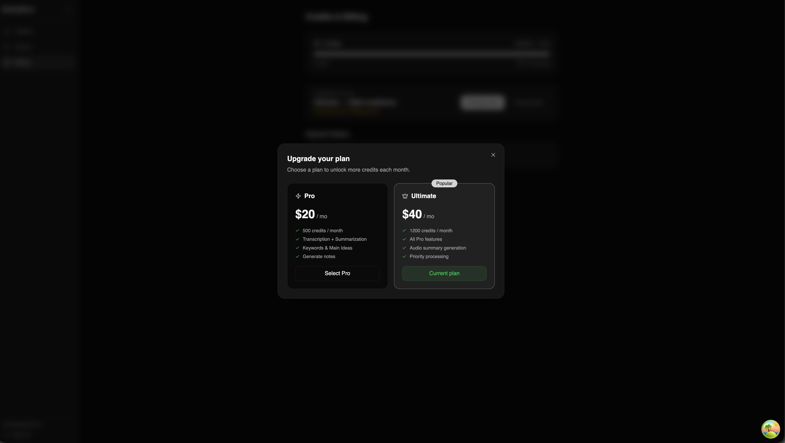

<p align="center">
  
</p>

<h1 align="center">xgist</h1>

<p align="center">
  AI-powered media transcription and summarization platform.
  <br />
  Upload video or audio → get timestamped transcripts, summaries with citations, keywords, notes, and audio summaries.
</p>

## Demo

| Upload | Processing Queue |
|--------|-----------------|
|  |  |

| Media Detail | Detail with Citations |
|-------------|----------------------|
|  |  |

| Notes | Billing |
|-------|---------|
|  |  |

| Subscription |
|-------------|
|  |

## Architecture

```
┌─────────┐   upload    ┌──────────────┐   Redis Stream   ┌──────────────┐
│  React  │ ──────────▶ │   Fastify    │ ───────────────▶ │    Python    │
│  SPA    │             │   + oRPC     │                  │    Worker    │
│         │ ◀────────── │   + Drizzle  │ ◀─────────────── │  Whisper +   │
│         │   polling   │   + MinIO    │   Redis Stream   │  Gemini API  │
└─────────┘             └──────────────┘                  └──────────────┘
                               │                                 │
                          PostgreSQL                           MinIO
```

## Tech Stack

| Layer | Technology |
|-------|-----------|
| Frontend | React Router v7, TypeScript, Tailwind CSS, shadcn/ui |
| Backend | Fastify, oRPC, Bun |
| Database | PostgreSQL, Drizzle ORM |
| Auth | Better Auth |
| Payments | Polar |
| Queue | Redis Streams |
| Storage | MinIO |
| AI | OpenAI Whisper, Google Gemini |

## Project Structure

```
apps/
  web/          React SPA (React Router v7)
  server/       Fastify API (oRPC + Drizzle)
  worker/       Python AI worker (Whisper + Gemini)
packages/
  api/          oRPC routers and contracts
  auth/         Better Auth config
  db/           Drizzle schema + migrations
  env/          Shared env validation (t3-env)
  config/       Shared constants
  types/        Shared TypeScript types
```

## Getting Started

### Prerequisites

- Node.js 22+
- pnpm 9+
- Docker (for PostgreSQL, Redis, MinIO)
- Python 3.11+ (for worker)

### Setup

```bash
pnpm install
docker compose up -d
cp apps/server/.env.example apps/server/.env
```

### Database

```bash
pnpm db:push        # push schema
pnpm db:migrate     # run migrations
pnpm db:studio      # open Drizzle Studio
```

### Development

```bash
pnpm dev             # all apps
pnpm dev:web         # frontend only
pnpm dev:server      # backend only
```

Web: http://localhost:5173 · API: http://localhost:3000

## Key Features

- Drag-and-drop media upload with file validation
- AI processing options with credit cost preview
- Real-time job queue with status polling
- Timestamped transcript synced to media player
- Summary with citation references to transcript segments
- Keywords, main ideas, and markdown notes
- Audio summary generation (TTS)
- Credit-based billing with Polar integration

## License

MIT
