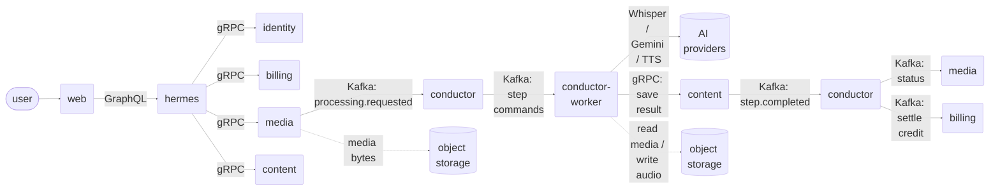
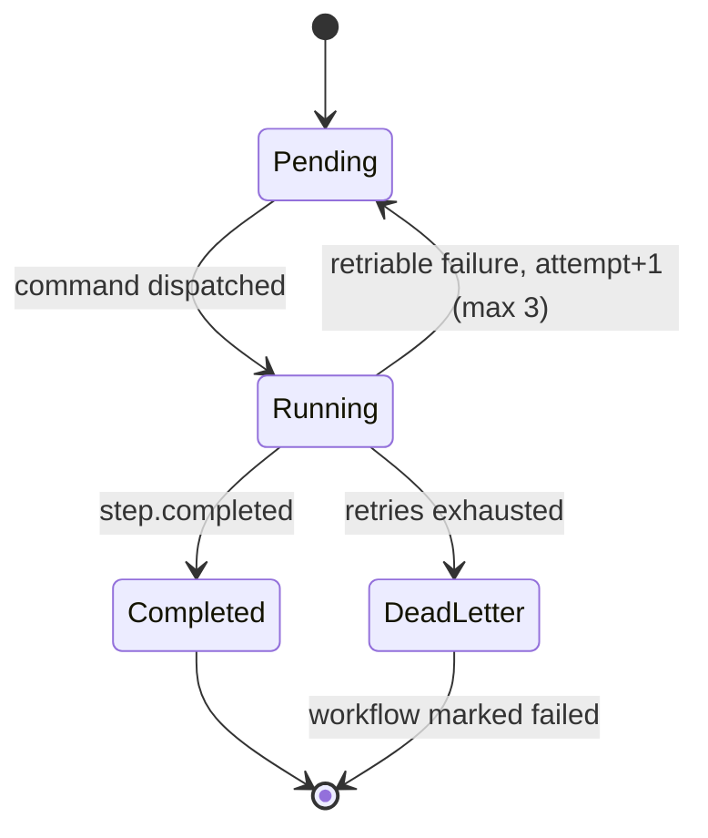
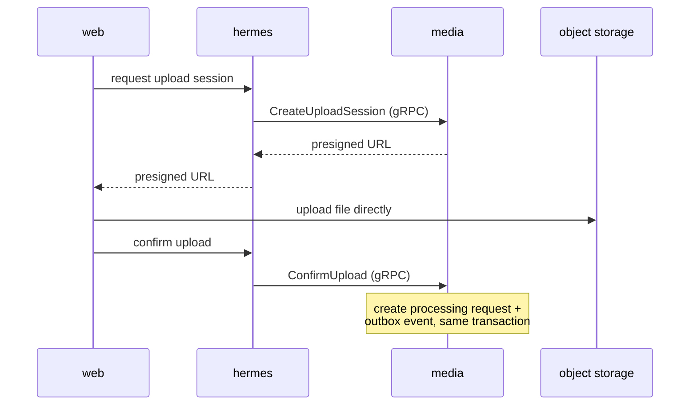
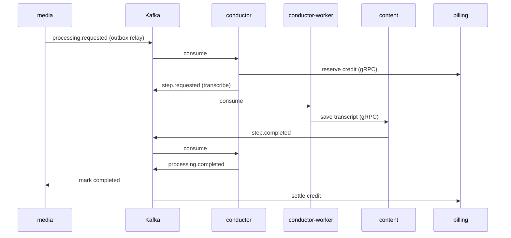
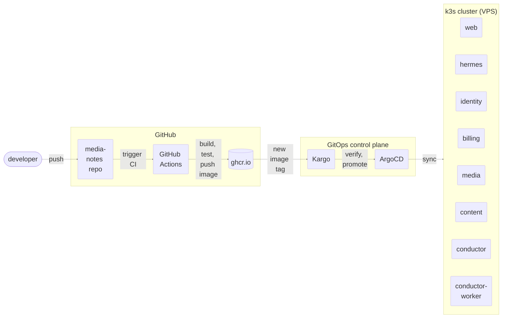

# Media Notes

Media Notes turns an uploaded video or audio file into a timestamped
transcript, a cited summary, keywords, keypoints, notes, and a summary
audio, each linked back to the exact moment in the recording it came from.
The interesting part isn't the transcription itself — Whisper and Gemini do
that — it's that every upload triggers several independent, minutes-long AI
calls that must survive a crash, retry without duplicating work, and bill a
credit correctly even when a step fails halfway through.

Seven independently deployable services split that problem along the two
things a client request actually needs: an immediate answer, served over
gRPC behind a single GraphQL gateway, or a durable background job, carried
over Kafka and coordinated by a workflow engine. No service reads another
service's database directly; every cross-service write goes through a
versioned gRPC or Kafka contract.

## Features

Processing runs against a fixed catalog of six independently selectable,
individually priced steps: `transcribe`, `summarize`, `extract_keywords`,
`extract_keypoints`, `generate_notes`, and `generate_audio_summary`. Only the
selected steps run and only their credit gets reserved — asking for a
transcript alone costs and takes less than asking for the full pass. Every
Gemini-backed step (`summarize`, `extract_keywords`, `extract_keypoints`,
`generate_notes`) accepts an optional prompt override, and
`generate_audio_summary` accepts an optional voice override, both per
request. A thumbnail or cover image is generated for every upload
automatically, regardless of selection, and isn't billed.

Accepted input is MP4, MOV, MKV, WebM, MP3, or WAV up to 4 hours of measured
duration. Declared size and duration from the client are never trusted —
`media` probes the uploaded object itself before accepting it.

Billing is credit-based: each selected step reserves credit up front,
settles it on success, and releases or refunds it on permanent failure.
Credits come from a subscription plan or a one-off top-up, both purchased
through Polar-backed checkout that `hermes` exposes to the web app.

## Architecture


```mermaid
%%{init: {"themeVariables": {"fontSize": "52px"}, "flowchart": {"curve": "linear", "padding": 36, "nodeSpacing": 90, "rankSpacing": 110, "diagramPadding": 30, "subGraphTitleMargin": {"top": 20, "bottom": 20}}}}%%
flowchart LR
    U(["user"]) --> WEB("web")
    WEB -- "GraphQL" --> HERMES("hermes")

    HERMES -- "gRPC" --> IDENTITY("identity")
    HERMES -- "gRPC" --> BILLING("billing")
    HERMES -- "gRPC" --> MEDIA("media")
    HERMES -- "gRPC" --> CONTENT("content")

    MEDIA -- "Kafka: processing.requested" --> CONDUCTOR("conductor")
    CONDUCTOR -- "Kafka: step commands" --> WORKER("conductor-worker")
    WORKER -- "Whisper / Gemini / TTS" --> AI[("AI providers")]
    WORKER -- "gRPC: save result" --> CONTENT_RESULT("content")
    CONTENT_RESULT -- "Kafka: step.completed" --> CONDUCTOR_JOIN("conductor")
    CONDUCTOR_JOIN -- "Kafka: status" --> MEDIA_STATUS("media")
    CONDUCTOR_JOIN -- "Kafka: settle credit" --> BILLING_SETTLE("billing")

    MEDIA -.->|"media bytes"| UPLOAD_STORAGE[("object storage")]
    WORKER -.->|"read media / write audio"| AUDIO_STORAGE[("object storage")]
```

Repeated `content`, `conductor`, `media`, and `billing` nodes are the same
service shown at a later point in the pipeline, kept as separate nodes so
every edge points left-to-right instead of looping back across another
connection. The two `object storage` nodes are the same MinIO/S3 deployment
for the same reason.

### Request Path

`hermes` is the only service the web app calls. It exposes GraphQL,
authenticates every request, and calls `identity`, `billing`, `media`, and
`content` over gRPC — one aggregation point instead of the client fanning
out to four services itself. Every downstream call carries a deadline
(`HERMES_DOWNSTREAM_TIMEOUT`, 5s by default) and propagates tracing context,
so a slow domain service degrades that one field instead of hanging the
whole request.

### Processing Pipeline and Fault Handling

Everything past the upload step runs off that request path entirely.
`media` writes a processing request and an outbox event in the same
transaction; a relay publishes it to Kafka, and `conductor` takes it from
there. Kafka delivery is at-least-once and every command carries an
idempotency key, so a crashed worker resumes from the last completed step
instead of restarting the job or double-processing one.

Each workflow step moves through the same lifecycle:


```mermaid
stateDiagram-v2
    [*] --> Pending
    Pending --> Running: command dispatched
    Running --> Completed: step.completed
    Running --> Pending: retriable failure, attempt+1 (max 3)
    Running --> DeadLetter: retries exhausted
    Completed --> [*]
    DeadLetter --> [*]: workflow marked failed
```

A retriable failure is redispatched with an incremented attempt, up to
`CONDUCTOR_MAX_STEP_ATTEMPTS` (3 by default); once exhausted, the event goes
to the dead-letter queue, the workflow is marked failed, and `billing`
releases or refunds the reserved credit. Each `conductor-worker` command
carries its own timeout (`WORKER_STEP_TIMEOUT_SECONDS`, 600s by default) so
one stuck Whisper or Gemini call can't hold a Kafka partition open
indefinitely.

Cross-replica provider quota reservation (ADR 0007) is not implemented yet —
each `conductor-worker` replica currently applies only local concurrency
limits (`WORKER_MAX_CONCURRENT_WHISPER`, `_GEMINI`, `_TTS`), not an
aggregate reservation shared across the pool.

### Database Ownership

| Service | Owns |
| --- | --- |
| `identity` | users, accounts, sessions, roles |
| `billing` | subscriptions, credit reservations, ledger |
| `media` | media, upload sessions, processing requests, derivatives |
| `content` | transcripts, summaries, keywords, keypoints, notes, audio |
| `conductor` | workflows, steps, dependencies, attempts |
| `hermes`, `conductor-worker` | none — stateless |

Every stateful service also owns its own outbox/inbox tables for
transactional publication: a database write and the event announcing it
either both commit or neither does.

### Services

| Service | Responsibility |
| --- | --- |
| **hermes** | Public GraphQL API — auth context, request limits, aggregates responses from the domain services |
| **identity** | Users, accounts, sessions |
| **billing** | Subscriptions, credit reservation/settlement, ledger |
| **media** | Uploads, source-media metadata, processing requests |
| **content** | Transcripts, summaries, keywords, keypoints, notes, summary audio |
| **conductor** | Workflow orchestration — dependencies, joins, retries, timeouts |
| **conductor-worker** | Runs Whisper transcription, Gemini enrichment, and TTS as a Kafka consumer-group pool |

## Data Flow

### Upload Flow


```mermaid
sequenceDiagram
    participant W as web
    participant H as hermes
    participant M as media
    participant S as object storage

    W->>H: request upload session
    H->>M: CreateUploadSession (gRPC)
    M-->>H: presigned URL
    H-->>W: presigned URL
    W->>S: upload file directly
    W->>H: confirm upload
    H->>M: ConfirmUpload (gRPC)
    Note over M: create processing request +<br/>outbox event, same transaction
```

The file itself never passes through `hermes` or `media` — the browser
uploads directly to object storage with a presigned URL, and the only thing
that touches Kafka afterward is the outbox event.

### Processing Flow


```mermaid
sequenceDiagram
    participant M as media
    participant K as Kafka
    participant C as conductor
    participant Wk as conductor-worker
    participant Ct as content
    participant B as billing

    M->>K: processing.requested (outbox relay)
    K->>C: consume
    C->>B: reserve credit (gRPC)
    C->>K: step.requested (transcribe)
    K->>Wk: consume
    Wk->>Ct: save transcript (gRPC)
    Ct->>K: step.completed
    K->>C: consume
    C->>K: processing.completed
    K->>M: mark completed
    K->>B: settle credit
```

This diagram shows one step (transcribe) for readability. After
transcription, `conductor` publishes only the enrichment steps the user
selected — summary, keywords, keypoints, notes — and Kafka may hand them to
different `conductor-worker` replicas in parallel. `conductor` joins only
the outputs the user asked for before publishing `processing.completed`.

## Deployment

This is target infrastructure, not yet wired up in this repo — GitHub
Actions currently only builds, lints, and tests
(`.github/workflows/ci.yml`); the publish and GitOps steps below are the
design it's built toward. A single k3s cluster on a VPS runs production, and
the goal is the same one that shapes the rest of the system: no step should
depend on someone remembering to run it by hand. GitHub Actions builds and
tests every push, then publishes a versioned image to GHCR. Kargo watches
GHCR for new images, runs verification against them, and — once a freight
passes — promotes it by committing the new image tag into `deploy/` in this
repo. ArgoCD continuously watches that same path and reconciles the cluster
to match it, so a deploy is always "a commit lands, ArgoCD syncs it," never a
manual `kubectl apply`.


```mermaid
%%{init: {"themeVariables": {"fontSize": "52px"}, "flowchart": {"curve": "linear", "padding": 36, "nodeSpacing": 90, "rankSpacing": 110, "diagramPadding": 30, "subGraphTitleMargin": {"top": 20, "bottom": 20}}}}%%
flowchart LR
    DEV(["developer"]) -- "push" --> REPO("media-notes repo")

    subgraph GH["GitHub"]
        REPO
        ACTIONS("GitHub Actions")
        GHCR[("ghcr.io")]
        REPO -- "trigger CI" --> ACTIONS
        ACTIONS -- "build, test, push image" --> GHCR
    end

    subgraph CTRL["GitOps control plane"]
        KARGO("Kargo")
        ARGOCD("ArgoCD")
        KARGO -- "verify, promote" --> ARGOCD
    end

    subgraph K3S["k3s cluster (VPS)"]
        direction TB
        WEB_S("web")
        HERMES_S("hermes")
        IDENTITY_S("identity")
        BILLING_S("billing")
        MEDIA_S("media")
        CONTENT_S("content")
        CONDUCTOR_S("conductor")
        WORKER_S("conductor-worker")
        WEB_S ~~~ HERMES_S ~~~ IDENTITY_S ~~~ BILLING_S ~~~ MEDIA_S ~~~ CONTENT_S ~~~ CONDUCTOR_S ~~~ WORKER_S
    end

    GHCR -- "new image tag" --> KARGO
    ARGOCD -- "sync" --> K3S
```

Three boundaries, three concerns: **GitHub** builds and publishes an image;
the **control plane** (Kargo + ArgoCD) decides what's allowed to run and
reconciles it; **k3s** just runs whatever the control plane last synced. The
flow only moves left to right — nothing loops back into an earlier
boundary — so no connector has to cross another.

Because there's only one environment today, Kargo's job is narrower than a
typical multi-stage setup: it's a verified, policy-gated image promoter
rather than something moving freight through dev → staging → prod. That
still keeps a human-reviewable Git commit between "image passed CI" and
"image is running in production" instead of ArgoCD auto-syncing on every
push to GHCR.

## Getting Started

### Installation

Requirements:

- Docker with Docker Compose for infra (Postgres, Kafka, Redis, MinIO).
- Go 1.26.4 or newer for the six Go services.
- Node.js and pnpm 10 for the web app.
- Python 3.11 or newer for `conductor-worker`.

Each service loads its own `.env`, copied from `.env.example` on first run
by its `make <service>:run` target.

### Running Locally

```bash
make infra:up            # Postgres, Kafka, Kafka UI, Redis, MinIO
make identity:migrate && make billing:migrate && make media:migrate \
  && make content:migrate && make conductor:migrate
```

```bash
make identity:run
make billing:run
make media:run
make content:run
make conductor:run
make hermes:run
make web:dev
```

Web: `http://localhost:5173` · hermes GraphQL: `http://localhost:8086/graphql`

Or bring everything up in containers: `docker compose --profile app up --build`.

### Testing

```bash
make build             # build the web app and every v2 service
make lint              # lint the web app
make typecheck         # type-check the web app
make test              # run web and v2 service tests
make check             # everything CI runs
```

Run `make help` to list every target across the root and per-service
makefiles.

## Learn more

Full request/event flow, failure and retry behavior, and storage boundaries
live in [docs/architecture.md](docs/architecture.md). Accepted design
decisions are in [docs/adr/](docs/adr/), and each service's detailed scope
and schema is in [docs/services/](docs/services/).
