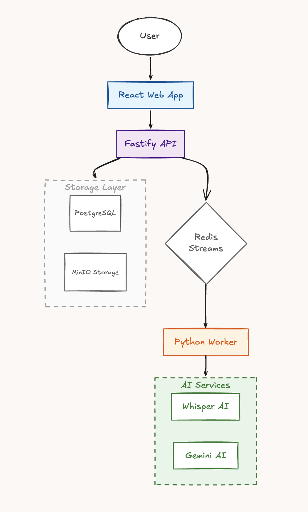
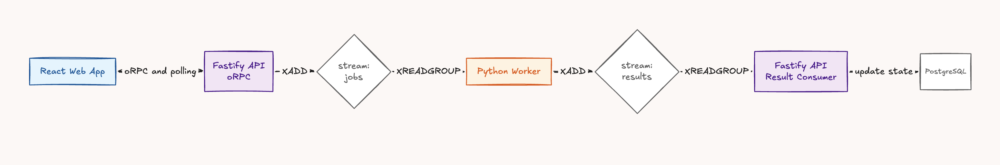

# media-notes

AI-powered media transcription and summarization platform that turns video or audio into timestamped transcripts, cited summaries, keywords, notes, and audio summaries.

## Architecture

<p align="center">
  
</p>

## Version 2 Migration

Media Notes 2 is currently a design package; its implementation is intentionally
not present in this branch. The existing version 1 application remains the
executable system and the migration can be implemented afresh from the accepted
decisions.

Start with the [system design](docs/architecture.md), the
[accepted architecture decisions](docs/adr/), and the
[service designs](docs/services/). The infrastructure, CI, and database
documents under `docs/` are implementation specifications, not instructions
for commands that exist today.

## System Design

### Web (React)

- **Media workspace** — drag-and-drop uploads with processing options and credit-cost previews
- **Progress tracking** — polls job state and presents queued, processing, completed, and failed states
- **Synchronized results** — connects transcript timestamps and summary citations to the media player
- **User accounts and billing** — Better Auth sessions with Polar-backed subscriptions and credit usage

### API (Fastify)

- **Typed API** — oRPC contracts connect the React client to Fastify handlers
- **Media storage** — uploads source media and generated audio summaries through MinIO
- **Persistent metadata** — Drizzle ORM stores users, media, processing state, and billing data in PostgreSQL
- **Asynchronous jobs** — publishes processing jobs and consumes worker results through Redis Streams

### Worker (Python)

- **Transcription** — OpenAI Whisper produces timestamped transcript segments
- **AI enrichment** — Google Gemini generates cited summaries, keywords, main ideas, and notes
- **Parallel processing** — independent enrichment tasks run concurrently after transcription
- **Audio summaries** — optional text-to-speech output is uploaded to MinIO
- **Reliable consumption** — Redis consumer groups acknowledge completed jobs and retry failed processing

### Communication

<p align="center">
  
</p>

## Tech Stack

| Component | Stack |
| --- | --- |
| Web | React Router v7, TypeScript, Tailwind CSS, shadcn/ui |
| API | Fastify, oRPC, Bun, Drizzle ORM |
| Worker | Python, OpenAI Whisper, Google Gemini |
| Data | PostgreSQL, Redis Streams, MinIO |
| Auth & Billing | Better Auth, Polar |
| Tooling | pnpm, Turborepo, Biome, Lefthook, Docker Compose |

## Quick Start

```bash
pnpm install
cp apps/server/.env.example apps/server/.env
cp apps/web/.env.example apps/web/.env
make infra:up
pnpm db:migrate
pnpm dev
```

Web: `http://localhost:5173` · API: `http://localhost:3000`


<summary><b>Development commands</b></summary>

```bash
pnpm dev:web          # frontend only
pnpm dev:server       # API only
pnpm db:studio        # inspect the database
pnpm check-types      # type-check all workspaces
pnpm lint             # run Biome
```

