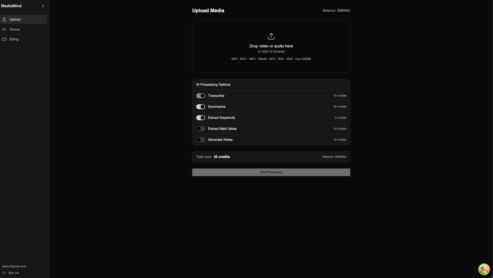
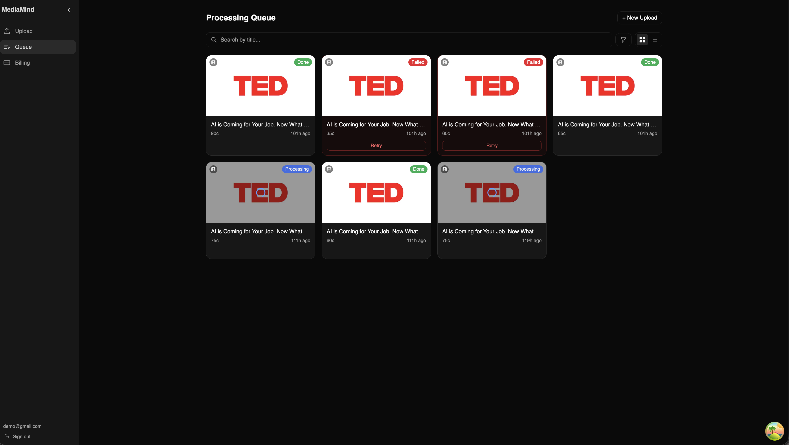
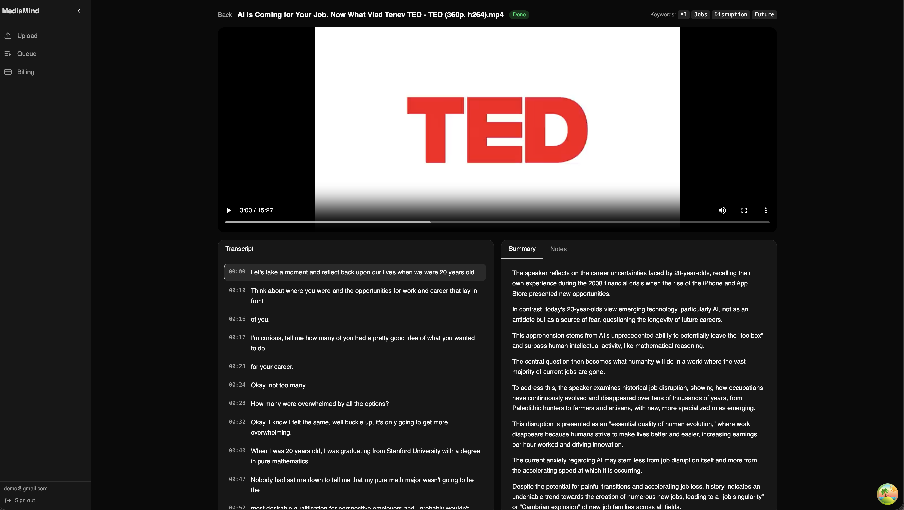
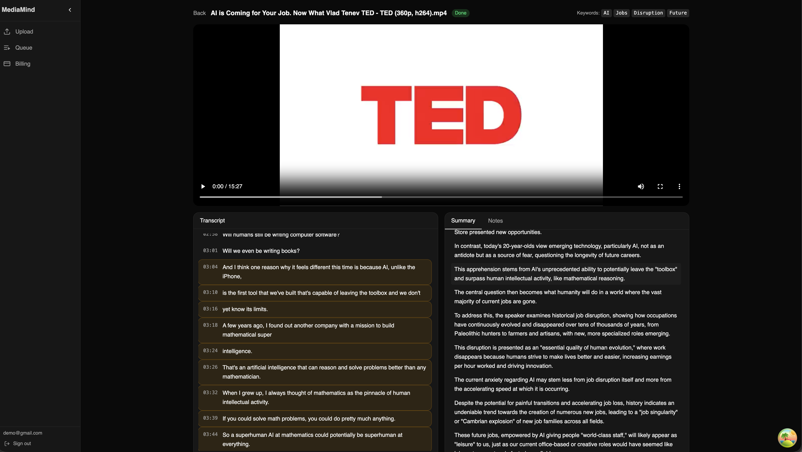
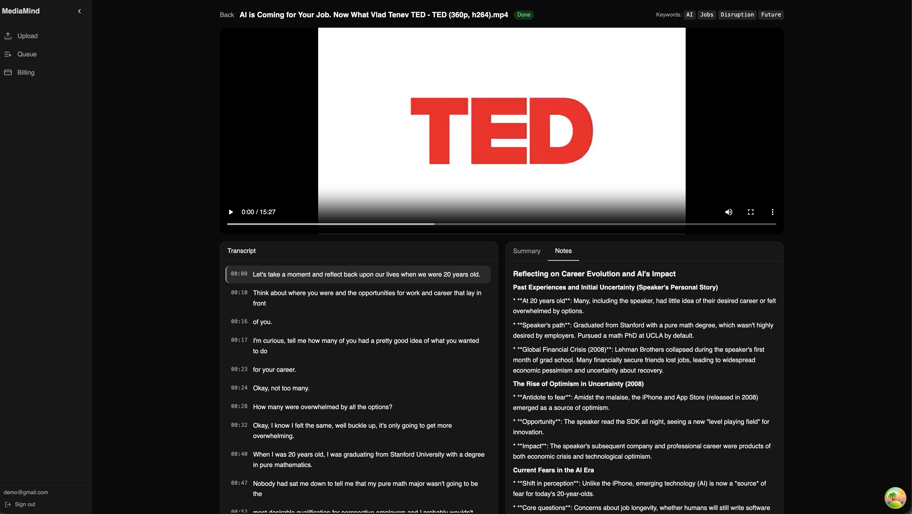
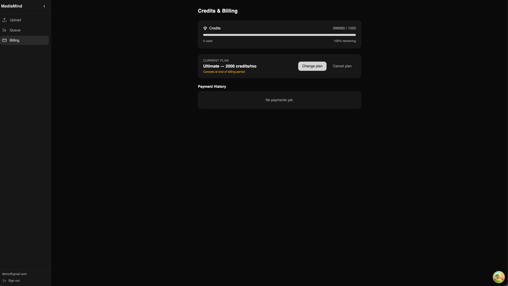
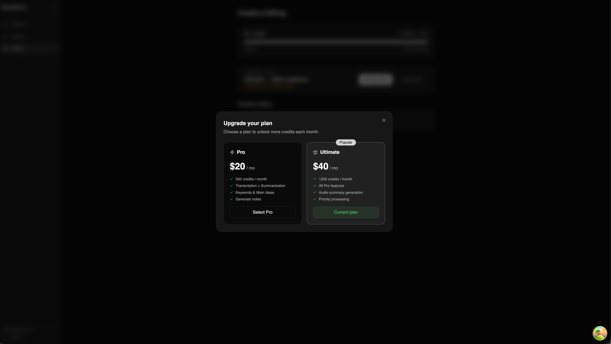

# xgist Product Tour

xgist turns uploaded video and audio into structured, searchable knowledge. The workflow covers media upload, asynchronous AI processing, timestamped playback, evidence-linked summaries, generated notes, and credit-based billing.

## Upload Media

Upload a supported video or audio file, then choose only the AI outputs needed for that job. Each option displays its credit cost before processing starts, making the total cost predictable.

Available processing options include transcription, summarization, keyword extraction, main-idea extraction, and generated notes.

## Track Processing

The queue provides a single place to monitor every media job. Status badges distinguish completed, processing, and failed jobs, while failed jobs can be retried directly from their cards. Search, filtering, and grid or list views help manage a larger media library.

## Explore the Results

Completed media opens in a workspace that keeps playback and generated content together. Timestamped transcript segments make long recordings easier to navigate, while the summary and extracted keywords provide a quick overview of the material.

### Evidence-linked summaries

Summary passages can be traced back to the transcript. Selecting a citation highlights the supporting transcript segments, helping users verify generated claims against the source material instead of treating the summary as a black box.

### Structured notes

The Notes view turns the transcript into a more detailed, organized document. It is useful for review, research, and extracting the main narrative without replaying the entire recording.

## Credits and Billing

xgist uses credits to make AI-processing usage visible. The billing dashboard shows the available balance, monthly allowance, current subscription, cancellation state, and payment history in one place.

### Subscription plans

The plan selector compares monthly credits and included capabilities before checkout. It also identifies the active plan, so users can understand which features are currently available before changing subscriptions.

For system design and local setup, return to the [project README](../README.md).
