# Media Notes 2 — Architecture Brainstorm

## Context

Media Notes v1 is complete. It uses a React client, a Fastify/oRPC server,
PostgreSQL, Redis Streams, MinIO, and one Python processing worker.

Version 2 is intentionally a microservices redesign. Its purpose is to make
service ownership, asynchronous workflows, independent deployment, horizontal
scaling, retries, and observability explicit without splitting every processing
function into a separate service.

## Problems to solve

- The v1 server owns API, authentication, billing, media, job publication,
  result consumption, and persistence.
- The Python worker processes jobs sequentially.
- Workflow state and retry decisions are distributed between the server and
  worker.
- Large results pass through Redis Streams.
- Business domains cannot be deployed or scaled independently.

## Design principles

- Go services own normal business logic and workflow coordination.
- Python executors own compute-heavy Whisper, Gemini, and TTS work.
- Kafka distributes commands through consumer groups; no service selects a
  concrete executor instance.
- PostgreSQL stores transcript and all text or structured results.
- Object storage stores uploaded audio/video, generated thumbnails, and
  generated summary audio.
- Kafka messages contain IDs, state, object keys, and small metadata—not media
  files or full transcripts.
- Each service owns its database schema and never writes another service's
  tables directly.
- Start with coarse domain boundaries; split further only when ownership or
  scaling requirements differ.

## Proposed services

| Service | Runtime | Responsibility |
| --- | --- | --- |
| `hermes` | Go, GraphQL | Public API, auth context, batching, aggregation |
| `identity` | Go, gRPC | Users, accounts, sessions, roles |
| `billing` | Go, gRPC, Kafka | Polar, subscriptions, credit reservation and ledger |
| `media` | Go, gRPC, Kafka | Uploads, media metadata, processing requests |
| `content` | Go, gRPC, Kafka | Transcript, summaries, keywords, keypoints, notes, audio metadata |
| `conductor` | Go, Kafka | Workflow state machine, commands, joins, retry, timeout |
| `conductor-worker` | Python, Kafka | Whisper, Gemini enrichment, TTS; horizontally scaled pool |

Infrastructure such as Kafka, PostgreSQL, MinIO/S3, Redis, and OpenTelemetry is
not counted as an application service.

## Architecture direction

```mermaid
%%{init: {"themeVariables": {"fontSize": "52px"}, "flowchart": {"curve": "linear", "padding": 34, "nodeSpacing": 80, "rankSpacing": 100}}}%%
flowchart LR
    WEB["web"] -->|"graphql"| HERMES["hermes"]
    HERMES -->|"grpc"| MEDIA["media"]
    MEDIA -->|"processing.requested"| K1[("kafka")]
    K1 --> CONDUCTOR["conductor"]
    CONDUCTOR -->|"step.requested"| K2[("kafka")]
    K2 --> WORKER["conductor-worker"]
    WORKER -->|"grpc result"| CONTENT["content"]
    CONTENT -->|"step.completed"| K3[("kafka")]
    K3 --> CONDUCTOR2["conductor"]
```



Kafka and repeated service nodes represent different stages of one left-to-right
data flow. Repeated `conductor` nodes are the same deployment, not additional
services.

## Ownership decisions

### `hermes`

`hermes` is the only public API. It authenticates requests, propagates identity
context, calls internal gRPC services, and shapes GraphQL responses. It owns no
domain database.

### `identity`

`identity` owns accounts and authentication data. Other services store
`user_id` as an external UUID reference and do not join identity tables.

### `billing`

`billing` owns subscriptions and credits. Processing uses credit reservation
followed by settlement or release, avoiding direct balance writes from
`media`, `content`, or `conductor`.

### `media`

`media` owns:

- Media and upload metadata.
- Processing requests and user-selected options.

### `content`

`content` owns:

- Full transcript and transcript segments.
- Summaries, keywords, keypoints, notes, and source references.
- Summary-audio metadata and its object key.

This separates the uploaded media lifecycle from generated, query-heavy
content. `hermes` calls `media` for metadata and `content` for content.

### `conductor`

`conductor` is the actual workflow conductor. It decides which step runs,
tracks dependencies and attempts, joins parallel enrichment results, applies
retry and timeout policy, and marks workflows completed or failed.

It does not run Whisper, Gemini, TTS, download media, or persist generated
content.

### `conductor-worker`

`conductor-worker` is a pool of stateless Python executors. Kafka consumer groups
assign commands to available replicas. Each command identifies a step such as:

- `transcribe`
- `summarize`
- `extract_keywords`
- `extract_keypoints`
- `generate_notes`
- `generate_audio_summary`

Workers send text or structured results to `content` through gRPC. They write
generated thumbnails and summary-audio bytes to object storage.

## Media-list thumbnail strategy

The main page must not fetch the original media for every list item.
`conductor-worker` generates a small thumbnail after upload while transcription
runs independently.

```text
upload confirmed
  ├→ generate thumbnail
  └→ transcribe
```

For video, the worker extracts a representative frame with FFmpeg, resizes it,
encodes it as WebP, and writes it to object storage. For audio, it uses embedded
cover art, a generated waveform, or a default media-type image.

`media` owns thumbnail metadata and maps the derivative to `media_id`. The
main-page query returns only media metadata and a thumbnail URL. The detail page
requests a playback URL only when the user opens or plays the media.

The initial thumbnail target is 320×180 WebP. Object keys are versioned so
thumbnails can use long-lived immutable cache headers.

## Main workflow

```text
upload
  → reserve credit
  → transcribe
  → enrich selected outputs in parallel
  → generate summary audio when requested
  → settle credit
  → complete
```

For every processing step:

```text
conductor
  → Kafka command
  → conductor-worker
  → content persists result
  → Kafka completion event
  → conductor advances workflow
```

## Alternatives rejected for the initial design

| Alternative | Reason |
| --- | --- |
| Keep content in `media` | Media lifecycle and generated content have different ownership, queries, and future scaling needs |
| Separate `querysvc` | CQRS can be introduced later; `media` and `content` can initially serve their own reads |
| Separate worker per AI capability | Whisper, Gemini, and TTS commands can share one executor codebase while scaling through Kafka |
| Worker calls conductor directly | Couples executors to orchestration and weakens replay and recovery |
| Conductor selects a worker instance | Kafka consumer groups already provide distribution and rebalancing |
| Store transcript in object storage | Transcript, keywords, keypoints, notes, and summaries need relational queries and updates |
| Put full results in Kafka | Large payloads reduce broker efficiency and complicate retention |

## Open questions

- Expected media volume, duration, and maximum upload size.
- GPU execution is selected for production Whisper workers after the
  maintainer measured it at 17 times faster than CPU. CPU `int8` remains the
  local-development and bounded fallback configuration. Evidence and
  provenance are recorded in
  [`docs/benchmarks/whisper-cpu-gpu.md`](../docs/benchmarks/whisper-cpu-gpu.md).
- Whether measured step latency or resource isolation eventually justifies
  splitting the shared step-command topic by capability.
- Whether progress delivery initially uses polling, SSE, or GraphQL
  subscriptions.
- When read traffic is large enough to justify extracting `querysvc`.

## Success criteria

- Multiple `conductor-worker` replicas process unrelated media concurrently.
- Restarting a worker does not lose workflow state.
- Every command and completion handler is idempotent.
- Text results are durable before a completion event is published.
- Uploaded media, thumbnails, and summary audio never travel through Kafka.
- Each service can be deployed and migrated independently.
- Traces connect GraphQL requests, gRPC calls, Kafka events, and worker steps.
