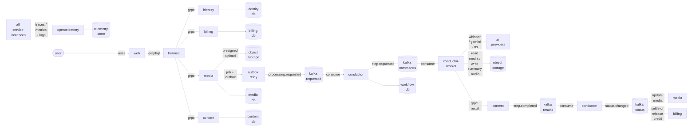

# Media Notes 2 — Target System Design

## Architecture

Media Notes 2 has seven application services. Go services handle the public API,
domain logic, persistence, and workflow coordination. A horizontally scaled
Python executor pool handles compute-heavy processing.



All connectors use Mermaid's linear curve so each connection is a straight
segment rather than an orthogonal bent path. Kafka nodes are topic groups in one
cluster. Repeated `media`, `content`, `conductor`, and `billing`
nodes are the same deployments shown at
different points in the left-to-right data flow. When another step is required,
`conductor` repeats the Kafka command segment; the overview draws one
iteration to remain readable. The two `object storage` nodes represent the same
MinIO/S3 deployment and are repeated to keep both storage paths straight.

## Services

| Service | Runtime | Responsibility |
| --- | --- | --- |
| `hermes` | Go, GraphQL | Public API, authentication context, batching, aggregation |
| `identity` | Go, gRPC | Users, accounts, sessions, roles |
| `billing` | Go, gRPC, Kafka | Polar, subscriptions, credit reservation, settlement, ledger |
| `media` | Go, gRPC, Kafka | Uploads, media metadata, processing requests |
| `content` | Go, gRPC, Kafka | Transcript, generated content, summary-audio metadata, content queries |
| `conductor` | Go, Kafka | Workflow state machine, commands, dependencies, joins, retry, timeout |
| `conductor-worker` | Python, Kafka | Whisper, Gemini, TTS; deployed as a consumer-group pool |

Kafka, PostgreSQL, MinIO/S3, Redis, and OpenTelemetry are infrastructure, not
application services.

## Storage boundary

PostgreSQL stores:

- Media metadata and processing requests.
- Full transcript and ordered transcript segments.
- Summary text.
- Keywords and scores.
- Keypoints and their transcript references.
- Notes.
- Summary citations.
- Summary-audio metadata and object key.

Object storage stores only:

- Audio/video uploaded by the user.
- Generated thumbnails or audio waveform previews.
- Generated summary-audio bytes.

Kafka stores only small messages:

- IDs and idempotency keys.
- Workflow and step state.
- Object keys.
- Attempt number and timestamps.
- Error codes and small metadata.

Media bytes, transcript text, and generated long-form content do not travel
through Kafka.

Media size, duration, upload-session, API traffic, and payload guardrails are
defined in
[`ADR 0004`](../docs/adr/0004-media-and-traffic-limits.md). These limits are
enforced from client feedback through authoritative object metadata and worker
probing; client-declared size and duration are never trusted.

## Media list and thumbnail delivery

The main page never requests the original audio/video object. After upload,
`conductor` schedules `generate_thumbnail` independently from transcription:

```text
upload confirmed
  ├→ generate_thumbnail
  └→ transcribe
```

For video, `conductor-worker`:

1. Reads only the media range required by FFmpeg.
2. Selects a representative frame instead of always using the first frame.
3. Resizes it to 320×180.
4. Encodes it as WebP.
5. Writes the image to object storage.
6. Calls `media` to register the derivative metadata.

For audio, the executor prefers embedded cover art. If none exists, it may
generate a waveform preview or use a default media-type image.

The list API returns only lightweight fields:

```json
{
  "id": "media-id",
  "title": "Media title",
  "mediaType": "video",
  "durationMs": 120000,
  "status": "completed",
  "thumbnailUrl": "https://...",
  "createdAt": "..."
}
```

It does not return a playback URL, transcript, or generated content. The Web
uses lazy-loaded images and a placeholder while `thumbnail_status` is pending.

When the detail page opens, `hermes` fetches:

- Metadata and a short-lived playback URL from `media`.
- Transcript and generated content from `content`.

The video element uses `preload="none"` unless metadata is required before the
user presses play.

Thumbnail objects use versioned keys and immutable cache headers, for example:

```text
media/{media_id}/source
media/{media_id}/thumbnail/v1.webp
media/{media_id}/summary-audio/{audio_id}.mp3
```

The list query uses cursor pagination and an index on
`media(owner_id, created_at desc)`. If signing one URL per row becomes
expensive, thumbnails should be served through a CDN with signed cookies or a
batched signing operation.

## End-to-end flow

### 1. Upload

```text
web
  → hermes
  → media
  → presigned URL
  → web uploads directly to object storage
  → media confirms upload
```

1. `web` requests an upload session through `hermes`.
2. `hermes` calls `media` through gRPC.
3. `media` creates a media record and returns a presigned URL.
4. `web` uploads audio/video directly to object storage.
5. `web` confirms the upload.
6. `media` atomically creates a processing request and outbox event.

### 2. Start workflow

```text
media
  → kafka: processing.requested
  → conductor
```

1. The outbox relay publishes `media.processing.requested`.
2. `conductor` creates a workflow and required steps.
3. `conductor` requests a credit reservation from `billing`.
4. After reservation succeeds, `conductor` publishes
   `processing.step.requested` for `transcribe`.

### 3. Transcription

```text
conductor
  → kafka: transcribe requested
  → conductor-worker
  → object storage: read media
  → whisper
  → content: save transcript
  → kafka: transcribe completed
  → conductor
```

Kafka assigns the command to one available `conductor-worker` replica. The
executor reads the uploaded media, runs Whisper, and calls `content` through
gRPC with the transcript and ordered segments.

`content` commits the transcript before publishing the completion event.

### 4. Enrichment

After transcription, `conductor` publishes only the steps selected by the
user:

```text
summary.requested
keywords.requested
keypoints.requested
notes.requested
```

Kafka may distribute these commands to different executor replicas:

```text
conductor-worker a → summary
conductor-worker b → keywords
conductor-worker c → keypoints
conductor-worker d → notes
```

Each executor:

1. Reads the transcript from `content`.
2. Runs Gemini.
3. Sends the structured result to `content` through gRPC.
4. Waits for `content` to commit.
5. Causes a small completion event to be published.

`conductor` consumes completion events and joins only the outputs selected by
the user.

### 5. Summary audio

If summary audio is selected:

```text
conductor
  → kafka: audio summary requested
  → conductor-worker
  → content: read summary text
  → tts
  → object storage: write summary audio
  → content: save object key and metadata
  → kafka: audio summary completed
```

The step completes only after the audio object is durable and its metadata is
committed.

Gemini and TTS calls use deployment-specific quota admission before a step is
published. `conductor` owns aggregate reservations and retries; workers
apply local concurrency and timeouts. Production TTS must use an authenticated,
supported provider rather than the development-only `edge-tts` integration.
Quota verification, backpressure, failure classification, observability, and
rollout are defined in
[`ADR 0007`](../docs/adr/0007-provider-quota-and-admission-control.md).

### 6. Completion

When all required steps are complete:

```text
conductor
  → kafka: processing.completed
  ├→ media: mark media completed
  └→ billing: settle reserved credit
```

`web` reads progress through `media` and generated content through
`content`; `hermes` aggregates both responses.

Progress delivery initially uses adaptive polling through a dedicated batched
GraphQL query. The interval, cache behavior, failure handling, delivery
objective, and criteria for reconsidering SSE are defined in
[`ADR 0005`](../docs/adr/0005-progress-update-delivery.md).

Media and account deletion are asynchronous cross-service workflows. The
lifecycle owner immediately removes product access, while each service deletes
only its own rows and object keys and reports durable completion. Retention
defaults, tombstones, failure recovery, backup behavior, and rollout controls
are defined in
[`ADR 0006`](../docs/adr/0006-data-retention-and-deletion.md).

### 7. Failure and retry

```text
conductor-worker
  → kafka: step.failed
  → conductor
  → retry or fail workflow
```

- Retriable failure: `conductor` publishes a new command with an incremented
  attempt.
- Retry exhausted: event goes to the DLQ and workflow becomes `failed`.
- Terminal failure: `billing` releases or refunds reserved credit.
- Every command contains an idempotency key so a repeated delivery does not
  duplicate data.

## Database ownership

The first deployment may use one PostgreSQL cluster, but every service uses a
separate schema and database credential. A service never writes another
service's schema.

Cross-service IDs are plain UUID references. There are no foreign keys across
service boundaries.

### `identity` — `identity db`

| Table | Important columns |
| --- | --- |
| `users` | `id`, `email`, `name`, `image_url`, `email_verified_at`, timestamps |
| `accounts` | `id`, `user_id`, `provider`, `provider_account_id`, encrypted tokens |
| `sessions` | `id`, `user_id`, `token_hash`, `expires_at`, client metadata |
| `verifications` | `id`, `identifier`, `value_hash`, `expires_at` |

Constraints:

- Unique normalized `users.email`.
- Unique `(provider, provider_account_id)`.
- Index `sessions(user_id, expires_at)`.

### `billing` — `billing db`

| Table | Important columns |
| --- | --- |
| `billing_accounts` | `id`, `user_id`, `polar_customer_id`, `status` |
| `subscriptions` | `id`, `billing_account_id`, provider ID, plan, status, period timestamps |
| `credit_accounts` | `user_id`, `available`, `reserved`, `version`, `updated_at` |
| `credit_reservations` | `id`, `user_id`, `workflow_id`, `amount`, `status`, `expires_at` |
| `credit_ledger` | `id`, `user_id`, `reservation_id`, `delta`, `entry_type`, `idempotency_key`, metadata |
| `webhook_events` | `provider_event_id`, `event_type`, `payload`, `processed_at` |
| `inbox_events` | `event_id`, `topic`, `processed_at` |
| `outbox_events` | `id`, `topic`, `event_key`, `payload`, `published_at` |

The ledger is append-only. `credit_accounts` is a current-balance projection
updated with optimistic locking through `version`.

Launch pricing preserves the version 1 additive option costs. `billing`
issues an immutable versioned quote and reserves the quoted maximum before work
starts. Each selected item settles exactly once only after its durable outcome;
failed or cancelled items release their remainder, and retries are not newly
billable. Pricing compatibility, quote lifecycle, reservation expiry, refunds,
reconciliation, and rollout are defined in
[`ADR 0008`](../docs/adr/0008-credit-pricing-and-settlement.md).

### `media` — `media db`

| Table | Important columns |
| --- | --- |
| `media` | `id`, `owner_id`, `title`, `media_type`, `object_key`, MIME type, size, duration, checksum, status, timestamps |
| `upload_sessions` | `id`, `media_id`, `object_key`, `status`, `expires_at`, `completed_at` |
| `processing_requests` | `id`, `media_id`, `requested_by`, `options`, `workflow_id`, status, timestamps |
| `media_derivatives` | `id`, `media_id`, `derivative_type`, `object_key`, MIME type, width, height, size, status, version, timestamps |
| `inbox_events` | `event_id`, `topic`, `processed_at` |
| `outbox_events` | `id`, `topic`, `event_key`, `payload`, `published_at`, `attempts` |

`media.object_key` points to uploaded audio/video. `media` does not store
transcript or generated content.

`media_derivatives` initially stores `thumbnail`, `cover`, or `waveform`
metadata. Unique `(media_id, derivative_type, version)` prevents duplicate
variants. The binary derivative remains in object storage.

### `content` — `content db`

| Table | Important columns |
| --- | --- |
| `contents` | `id`, `media_id`, `workflow_id`, `language`, `transcript_text`, `version`, timestamps |
| `transcript_segments` | `id`, `content_id`, `segment_index`, `start_ms`, `end_ms`, `speaker`, `text` |
| `summaries` | `id`, `content_id`, `summary_type`, `text`, `model`, `prompt_version`, timestamps |
| `keywords` | `id`, `content_id`, `keyword`, `score`, `position` |
| `keypoints` | `id`, `content_id`, `point_index`, `text`, `start_segment`, `end_segment` |
| `notes` | `id`, `content_id`, `format`, `body`, timestamps |
| `summary_sentences` | `id`, `summary_id`, `sentence_index`, `text` |
| `summary_citations` | `summary_sentence_id`, `transcript_segment_id` |
| `audio_summaries` | `id`, `content_id`, `summary_id`, `object_key`, MIME type, duration, voice, status |
| `inbox_events` | `event_id`, `topic`, `processed_at` |
| `outbox_events` | `id`, `topic`, `event_key`, `payload`, `published_at`, `attempts` |

Important constraints:

- Unique `(content_id, segment_index)`.
- Unique `(content_id, keyword)`.
- Unique `(content_id, point_index)`.
- Unique `(summary_id, sentence_index)`.
- Unique `inbox_events.event_id`.

`audio_summaries.object_key` points to generated summary audio. All text is
stored directly in PostgreSQL.

### `conductor` — `workflow db`

| Table | Important columns |
| --- | --- |
| `workflows` | `id`, `media_id`, `request_id`, `user_id`, `state`, `version`, start/completion/deadline timestamps |
| `workflow_steps` | `id`, `workflow_id`, `step_type`, `state`, `required`, `current_attempt`, timestamps |
| `step_dependencies` | `step_id`, `depends_on_step_id` |
| `step_attempts` | `id`, `step_id`, `attempt`, `idempotency_key`, state, error details, timestamps |
| `inbox_events` | `event_id`, `topic`, `received_at`, `processed_at` |
| `outbox_events` | `id`, `topic`, `event_key`, `payload`, `published_at` |

Important constraints:

- Unique `(workflow_id, step_type)`.
- Unique `step_attempts.idempotency_key`.
- Unique `inbox_events.event_id`.
- Optimistic locking through `workflows.version`.

### `hermes`

`hermes` owns no domain database. Persisted GraphQL queries or rate-limit state
may use Redis, but domain records remain in their owning services.

### `conductor-worker`

`conductor-worker` is stateless. It uses temporary local disk only while
processing a command. Durable text outputs must be committed through
`content`; summary audio must be written to object storage and registered in
`content` before the command is acknowledged.

## Kafka topics

| Topic | Key | Producer | Consumer |
| --- | --- | --- | --- |
| `mn.media.processing.requested.v1` | `media_id` | `media` | `conductor` |
| `mn.processing.step.requested.v1` | `media_id` | `conductor` | `conductor-worker` |
| `mn.processing.step.completed.v1` | `media_id` | `content` | `conductor` |
| `mn.processing.step.failed.v1` | `media_id` | `conductor-worker` | `conductor` |
| `mn.media.derivative.ready.v1` | `media_id` | `media` | `conductor` |
| `mn.media.status.changed.v1` | `media_id` | `conductor` | `media` |
| `mn.billing.credit.reserve.v1` | `user_id` | `conductor` | `billing` |
| `mn.billing.credit.reserved.v1` | `user_id` | `billing` | `conductor` |
| `mn.billing.credit.settle.v1` | `user_id` | `conductor` | `billing` |
| `mn.processing.dlq.v1` | original key | retry policy | operations |

Topics are partitioned by `media_id` for processing order and by `user_id` for
billing order. Partition counts, retention, consumer groups, retry ownership,
and DLQ replay are defined in
[`ADR 0003`](../docs/adr/0003-kafka-topic-and-partition-strategy.md).

## Delivery and consistency

- Kafka delivery is at-least-once.
- Consumers use inbox tables or idempotency keys.
- Database writes and event publication use transactional outbox.
- `content` publishes completion only after committing a result.
- A worker acknowledges only after `content` accepts the text result, or
  after a thumbnail/summary-audio object and its metadata are durable.
- Retries use bounded exponential backoff with jitter.
- Exhausted retries go to the DLQ.
- Exactly-once business behavior comes from idempotent state transitions, not
  from assuming a message is delivered once.

## gRPC boundaries

`hermes` calls:

- `identity` for identity and account queries.
- `billing` for subscription and credit queries.
- `media` for uploads, media metadata, and processing status.
- `content` for transcript, summaries, keywords, keypoints, notes, and
  summary-audio metadata.

`conductor-worker` calls:

- `media` to read media metadata, object key, and processing options.
- `media` to register thumbnail, cover, or waveform metadata after writing
  the derivative object.
- `content` to read transcript or summary inputs.
- `content` to commit transcript and structured text results.
- `content` to commit summary-audio metadata after uploading the audio
  object.

Every call has a deadline, propagates tracing context, and uses an idempotency
key for write operations.

## Scaling

| Component | Scaling signal |
| --- | --- |
| `hermes` | Request rate, CPU, p95 latency |
| `identity` | Authentication traffic and latency |
| `billing` | Billing event lag and webhook traffic |
| `media` | gRPC request rate, database latency, outbox lag |
| `content` | Content read/write rate, database latency, outbox lag |
| `conductor` | Active workflows and Kafka lag |
| `conductor-worker` | Kafka lag, oldest message age, CPU/GPU, provider quota |

Worker parallelism is:

```text
effective parallelism = min(
  ready conductor-worker capacity,
  kafka partition count,
  available cpu/gpu,
  provider quota,
  storage bandwidth
)
```

## Deployment sequence

1. Define Protobuf gRPC contracts and versioned event schemas.
2. Extract `media` and migrate media/upload tables from v1.
3. Extract `content` and migrate transcript and generated-content tables.
4. Add transactional outbox and Kafka.
5. Introduce `conductor` with explicit workflow state.
6. Run multiple `conductor-worker` replicas in one consumer group.
7. Extract `identity`.
8. Extract `billing` and introduce credit reservation.
9. Add `hermes` and migrate the Web client to GraphQL.
10. Add tracing, autoscaling, DLQ operations, and recovery tooling.
